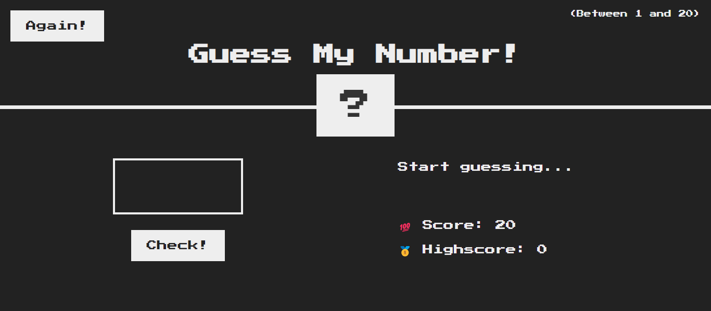

# Guess My Number! 🎲

A simple number guessing game built with HTML, CSS, and JavaScript.

## Introduction

Guess My Number! is a fun game where the player needs to guess a number between 1 and 20. The game provides feedback on each guess, indicating whether the guess is too high or too low. The player's goal is to guess the correct number with the fewest attempts possible.

## How to Play

1. Open the `index.html` file in your web browser.
2. Enter a number between 1 and 20 into the input field.
3. Click the "Check!" button to submit your guess.
4. Receive feedback on your guess and adjust accordingly.
5. Keep guessing until you find the correct number or run out of attempts.
6. If you win, try to beat your highscore! 🏆

## Features

- Responsive design for both desktop and mobile devices.
- Keeps track of the player's score and highscore.
- Provides visual feedback when the player wins or loses.
- Easy reset functionality to start a new game.

## File Structure

- `index.html`: Contains the structure of the game interface.
- `style.css`: Defines the styling rules for the HTML elements.
- `script.js`: Implements the game logic and interaction with the HTML elements.

## Live Demo

Check out the live demo [here](https://guess-my-number-2193.netlify.app/)! 🚀

## Author

Anas Hany

GitHub: [AnasHany2193](https://github.com/AnasHany2193)

LinkedIn: [Anas Hany](https://www.linkedin.com/in/anashany219/)

Feel free to reach out if you have any questions or feedback! 📧
